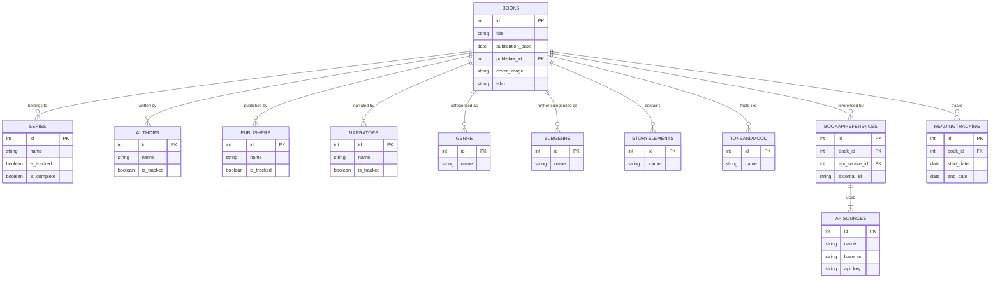

# Fabuloteca Documentation

## Overview

This document serves as a living reference manual for Fabuloteca, a personal project designed exclusively for personal use. However, it will be open source, allowing anyone to review and potentially contribute to the project.

As an avid audiobook listener, I have relied on Goodreads to track my audiobooks and discover new series. However, over time, I’ve found Goodreads increasingly inadequate, particularly when it comes to advanced filtering. While Goodreads offers a broad community and social features, I primarily need a tool for personal tracking that allows for more powerful and granular filtering options, tailored specifically to my preferences. This project aims to address these shortcomings by creating a more personalised and effective solution for managing and tracking my audiobook collection, series, and future reading plans.

---

## 1. Purpose and Project Goals

### 1.1. Summary
Fabuloteca is designed to cater to the specific needs that have outgrown existing solutions. By focusing on advanced filtering capabilities and personalised management, this project aims to create a tool that better aligns with the user’s unique requirements, particularly in managing a growing audiobook collection.

### 1.2. Key Objectives
- Provide comprehensive management of a personal book collection, with a focus on audiobooks.
- Enable advanced filtering based on genre, sub-genre, story elements, and tone/mood tags to easily find the right book for any given moment.
- Support detailed tracking of series, narrators, and upcoming book releases from favourite authors.
- Implement a flexible rating system that allows for weighted, user-configurable evaluations.
- Facilitate future expansion to accommodate evolving needs, ensuring the application remains useful over time.

---
## 2. Technology Stack

### 2.1. Front End
- **Technology**: .NET MAUI on .NET 8
- **Reasoning**: .NET MAUI was chosen for its ability to target both iOS and Windows natively. Leveraging .NET 8 ensures access to the latest features and performance improvements. It also utilises the developer's existing C# and .NET expertise, ensuring a streamlined development process.

### 2.2. Back End
- **Technology**: Entity Framework Core with SQLite on .NET 8
- **Reasoning**: Entity Framework Core offers robust ORM capabilities, simplifying database management and migrations. SQLite is used as it provides a lightweight, file-based database ideal for a personal project. Using .NET 8 ensures compatibility and modern development practices.

### 2.3. Version Control
- **Technology**: Git
- **Reasoning**: Git is selected for its flexibility and widespread usage. It will be used to manage the project’s source code and documentation, ensuring all changes are tracked and reversible.


---

## 3. Database Schema

### 3.1. Database Design Overview
The database schema is designed to support complex relationships between books, authors, series, publishers, narrators, genres, sub-genres, story elements, and tone/mood tags. Advanced filtering is made possible through these relationships, and a weighted rating system is implemented to customise the user experience. Additionally, fields have been added to support API tracking for new releases from specific authors, publishers, and series.

### 3.2. Tables and Relationships

#### 3.2.1. **Books Table**
- **Fields**: 
  - `id`: Primary key.
  - `title`: The title of the book.
  - `publication_date`: Date of publication.
  - `publisher_id`: Foreign key to the Publishers table.
  - `cover_image`: Path to the book cover image (nullable).
  - `isbn`: International Standard Book Number (ISBN) of the book.
- **Reasoning**: This table stores the main book data and links to related entities such as authors, genres, and publishers. The ISBN field allows for future cross-referencing with external data sources.

#### 3.2.2. **Series Table**
- **Fields**: 
  - `id`: Primary key.
  - `name`: Name of the series.
  - `is_tracked`: Boolean field to indicate if this series is tracked for new releases (nullable).
  - `is_complete`: Boolean field to indicate if the series is complete (nullable).
- **Reasoning**: This table tracks book series and includes fields to specify if the series should be tracked for new releases via API updates and whether the series is complete.

#### 3.2.3. **Authors Table**
- **Fields**: 
  - `id`: Primary key.
  - `name`: Name of the author.
  - `is_tracked`: Boolean field to indicate if this author is tracked for new releases.
- **Reasoning**: This table tracks authors and includes a field to specify if the author should be tracked for new releases via API updates.

#### 3.2.4. **Publishers Table**
- **Fields**: 
  - `id`: Primary key.
  - `name`: Name of the publisher.
  - `is_tracked`: Boolean field to indicate if this publisher is tracked for new releases (nullable).
- **Reasoning**: This table stores information about publishers and connects to the `Books` table through a many-to-many relationship. Any relationships between authors and publishers are indirect and established through the books.

#### 3.2.5. **Narrators Table**
- **Fields**: 
  - `id`: Primary key.
  - `name`: Name of the narrator.
  - `is_tracked`: Boolean field to indicate if this narrator is tracked for new releases (nullable).
- **Reasoning**: Essential for audiobooks, tracks narrators and their relationships to books, genres, and series.

#### 3.2.6. **Genre Table**
- **Fields**: 
  - `id`: Primary key.
  - `name`: Name of the genre (e.g., Fantasy, Science Fiction).
- **Reasoning**: Represents the broadest category of a book’s classification.

#### 3.2.7. **SubGenre Table**
- **Fields**: 
  - `id`: Primary key.
  - `name`: Type of sub-genre (e.g., Urban Fantasy, Cyberpunk).
- **Reasoning**: Further refines the book’s categorisation within its genre.

#### 3.2.8. **StoryElements Table**
- **Fields**: 
  - `id`: Primary key.
  - `name`: Specific story elements (e.g., Isekai, Progression).
- **Reasoning**: Captures specific narrative or plot-driven elements within the sub-genre.

#### 3.2.9. **ToneAndMood Table**
- **Fields**: 
  - `id`: Primary key.
  - `name`: Mood or tone (e.g., Dark, Wholesome).
- **Reasoning**: Enables filtering books based on the emotional or tonal qualities of the story.

#### 3.2.10. **APISources Table**
- **Fields**: 
  - `id`: Primary key.
  - `name`: Name of the API source (e.g., Goodreads, Fantastic Fiction).
  - `base_url`: Base URL of the API.
  - `api_key`: (Optional) API key or token for authenticated requests.
- **Reasoning**: Tracks the various external APIs that can be used to update book data, allowing for flexible integration.

#### 3.2.11. **BookAPIReferences Table**
- **Fields**: 
  - `id`: Primary key.
  - `book_id`: Foreign key to the `Books` table.
  - `api_source_id`: Foreign key to the `APISources` table.
  - `external_id`: ID or reference used by the external API to identify the book.
- **Reasoning**: Links books in the database to their corresponding entries in external APIs, facilitating updates and data synchronisation.

#### 3.2.12. **ReadingTracking Table**
- **Fields**: 
  - `id`: Primary key.
  - `book_id`: Foreign key to the `Books` table.
  - `start_date`: Date when the book reading started.
  - `end_date`: Date when the book reading ended (nullable).
- **Reasoning**: Tracks the start and end dates for reading a book, allowing users to monitor their reading habits over time.

### 3.3. Entity Relationships
- **BooksSeries**: Links books to series in a many-to-many relationship, including a `position_in_series` field (float/real) to indicate the book's place in the series.
- **BooksPublishers**: Links books to publishers in a many-to-many relationship.
- **BooksGenre**: Links books to genres in a many-to-many relationship.
- **BooksSubGenre**: Links books to sub-genres in a many-to-many relationship.
- **BooksStoryElements**: Links books to story elements in a many-to-many relationship.
- **BooksToneAndMood**: Links books to tone and mood descriptors in a many-to-many relationship.
- **BooksAuthors**: Links books to authors in a many-to-many relationship.
- **BooksNarrators**: Links books to narrators in a many-to-many relationship.
- **BookAPIReferences**: Links books to their corresponding entries in external APIs through the `APISources` table.
- **ReadingTracking**: Tracks reading sessions linked to books.

---

### 3.4. Entity Relationship Diagram



## 4. Front-End Architecture

### 4.1. .NET MAUI Overview
- **Cross-Platform Targeting**: Native support for Windows and iOS using .NET 8.
- **UI Design**: Focus on a responsive and adaptive layout, leveraging XAML for UI components.
- **Data Binding**: Use of MVVM for binding UI components to data models.

### 4.2. Interaction with Database
- **Entity Framework Core**: Utilised for data management and querying on .NET 8. Provides a seamless integration with the SQLite database.
- **Dependency Injection**: Configured to inject DbContext and other services across the application.

---

## 5. Version Control

### 5.1. Git Overview
- **Branching Strategy**: Describe the chosen branching strategy (e.g., GitFlow, trunk-based development).
- **Commit Guidelines**: Establish conventions for commit messages to ensure clarity.

### 5.2. CI/CD Considerations
- **Future Expansion**: Outline potential CI/CD pipelines, automated testing, and deployment strategies for future phases.

---

## 6. Future Expansions

### 6.1. Features Under Consideration
- **Reading Progress Tracking**
- **Book Recommendations**
- **User-Defined Tags and Labels**
- **Quotes/Excerpts Storage**
- **Hooks to Notify of Upcoming Books**: Notifications for upcoming books from tracked series, authors, publishers, and narrators.
- **Book/Author/Narrator/Publisher Online Image Fetching**: Automatic fetching of images for books, authors, narrators, and publishers from online sources.
- **Charts/Trends**: Visualisation of reading habits, genre trends, and other statistics.
- **Domain-Hosted with User Features**: Expansion to a domain-hosted version with features for multiple users, including accounts and personalisation.
- **Monthly and Yearly Personalised Statistics Reports**: Generation of detailed reports on reading activity, trends, and other personalised metrics.

---

## 7. Change Log
*This section is intentionally left empty until the project is started.*

---

## 8. References

- **.NET MAUI Documentation**: [https://dotnet.microsoft.com/en-us/learn/maui]
- **Entity Framework Core Documentation**: [https://learn.microsoft.com/en-us/ef/core/]
- **SQLite Documentation**: [https://www.sqlite.org/docs.html]
- **Git Documentation**: [https://git-scm.com/doc]

## 9. Architecture

### 9.1. System Context Diagram

```mermaid
C4Context
    title Fabuloteca System Context

    Person(user, "User", "A person who wants to manage their audiobook collection.")
    System(fabuloteca, "Fabuloteca", "A personal audiobook management system.")

    Boundary(user_system, "User Interactions") {
        user -> fabuloteca: "Manage and track books, series, authors, etc."
        user -> fabuloteca: "View statistics, reports, and trends"
        user -> fabuloteca: "Configure notifications and settings"
    }

    System_Ext(ExternalAPI, "External Book APIs", "Provides data on books, authors, and series")
    fabuloteca <- ExternalAPI: "Fetches book details, updates, and images"
```

### 9.2. Container Diagram

```mermaid
C4Container
    title Fabuloteca Container Diagram

    Person(user, "User", "A person who uses the Fabuloteca app to manage their audiobook collection.")
    
    System_Boundary(fabuloteca_boundary, "Fabuloteca Application") {
        Container_WebApp(web_app, "Fabuloteca UI", "MAUI (.NET 8)", "Cross-platform UI for Windows and iOS")
        Container_API(api, "Fabuloteca API", "ASP.NET Core (.NET 8)", "Handles business logic and data processing")
        Container_DB(database, "Fabuloteca Database", "SQLite", "Stores book, author, series, and tracking data")
    }

    System_Ext(ExternalAPI, "External Book APIs", "Provides data on books, authors, and series")

    user -> web_app: "Uses"
    web_app -> api: "Sends requests"
    api -> database: "Reads/Writes data"
    api -> ExternalAPI: "Fetches data"
```

### 9.3. Component Diagram (API)

```mermaid
C4Component
    title Fabuloteca API Component Diagram

    Container_Boundary(fabuloteca_api, "Fabuloteca API") {
        Component(auth_service, "Authentication Service", "ASP.NET Core Identity", "Handles user authentication and authorization.")
        Component(book_service, "Book Service", "C#", "Manages book data and interactions.")
        Component(series_service, "Series Service", "C#", "Handles series tracking and updates.")
        Component(reporting_service, "Reporting Service", "C#", "Generates monthly and yearly reports.")
        Component(notification_service, "Notification Service", "C#", "Sends notifications about upcoming books.")
        Component(api_controller, "API Controller", "ASP.NET Core", "Exposes API endpoints to the UI.")
    }

    api_controller -> auth_service: "Handles user authentication"
    api_controller -> book_service: "Manages book-related requests"
    api_controller -> series_service: "Manages series tracking"
    api_controller -> reporting_service: "Requests reports"
    api_controller -> notification_service: "Sends notifications"
```
